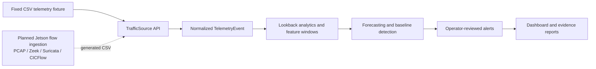

# Jetson Edge Intrusion Detection

**Defensive edge telemetry, lookback analytics, forecasting, and operator-reviewed IDS alerts for Jetson-class network nodes.**

Jetson Edge Intrusion Detection is a defensive edge telemetry system for Jetson-class nodes. The current implementation uses fixed CSV telemetry as a deterministic fixture for lookback analytics, forecasting, operator-reviewed alerts, reports, and dashboard evidence.

Fixed CSV is the deterministic test fixture, not the product ceiling. The planned Jetson sniffer upgrade adds Jetson-generated flow CSVs from packet capture and defensive telemetry sources such as Zeek logs, Suricata `eve.json`, and CICFlow-style records.

> [Open the evidence landing page](https://obiedeh.github.io/jetson-edge-ai-security/reports/index.html) | [Open the static dashboard](https://obiedeh.github.io/jetson-edge-ai-security/reports/dashboard.html) | [Architecture](docs/architecture.md) | [Thor runbook](deploy/thor/operator-runbook.md) | [Sniffer upgrade plan](docs/jetson-sniffer-upgrade-plan.md)

## Current Implementation

The working pipeline is intentionally small and inspectable:

```text
fixed CSV telemetry
  -> normalized TelemetryEvent records
  -> lookback analytics and sliding-window features
  -> baseline detection and forecasting evidence
  -> operator-reviewed alerts
  -> dashboard, reports, and benchmark templates
```

Implemented today:

- Pluggable `TrafficSource` API with context-manager lifecycle.
- `TelemetryEvent` and `Alert` schemas using Pydantic.
- CSV replay for Edge-IIoT-style datasets and similar IDS exports.
- Sliding-window feature extraction over iterable event streams.
- Rule-based baseline detector with optional `sklearn` IsolationForest support.
- Pipeline runner that tracks events, windows, detections, skipped rows, and emitted alerts.
- Typer CLI for config validation, CSV replay, demo execution, and static report generation.
- Static evidence pack under `reports/`.

## Why This Matters

Edge nodes, robotics cells, private-network sites, and AI-enabled systems need local defensive telemetry that can be reviewed close to the runtime environment. The value here is not replacing a SIEM or claiming a production IDS. The value is making local flow-style signals observable, forecastable, reviewable, and benchmarkable near the edge.

## Run This Demo

```bash
git clone https://github.com/obiedeh/jetson-edge-ai-security.git
cd jetson-edge-ai-security
python -m venv .venv
source .venv/bin/activate
python -m pip install -e ".[dev]"
edge-security run-demo
edge-security generate-demo-report --output-dir reports/demo
edge-security build-static-reports --reports-dir reports
```

Optional ML detector support:

```bash
python -m pip install -e ".[ml]"
```

## View the Evidence Pack

- [Landing page](reports/index.html)
- [Dashboard](reports/dashboard.html)
- [Demo replay report](reports/demo/replay_report.md)
- [Runtime metrics](reports/demo/runtime_metrics.json)
- [Training evidence](reports/training_run.json)
- [Thor benchmark template](reports/thor_benchmark.json)
- [Portfolio deliverables](PORTFOLIO_DELIVERABLES.md)

GitHub shows committed HTML files as source code. Use the GitHub Pages links at the top of this README to open rendered pages.

## Current vs Planned

| Layer | Current working system | Planned Jetson ingestion upgrade |
|---|---|---|
| Input source | Fixed CSV fixture | Jetson-generated flow CSV |
| Capture mode | Deterministic replay | SPAN, TAP, or local interface capture |
| Packet stage | Not required for current evidence | Rotating PCAP files |
| Flow extraction | CSV columns normalized into `TelemetryEvent` | Zeek `conn.log`, Suricata `eve.json`, CICFlow-style records |
| Analytics path | Lookback analytics, forecasting, alerts, reports | Same existing analytics path |
| Dashboard impact | Implemented | No detector/dashboard rewrite intended |
| Hardware benchmark | Template committed | Pending measured Thor-class run |

Adapters may change. The analytics pipeline should not.

## Defensive Boundary

This repo is defensive only.

- No malware generation.
- No exploit replay.
- No offensive tooling.
- No autonomous response.
- No line-rate capture claim.
- No production IDS deployment claim.
- No measured Thor latency, throughput, power, or memory claim until benchmark artifacts are committed.

## Planned Jetson Sniffer Upgrade

The planned upgrade is documented in [docs/jetson-sniffer-upgrade-plan.md](docs/jetson-sniffer-upgrade-plan.md).

Planned pipeline:

```text
SPAN/TAP/local interface
  -> rotating PCAP
  -> Zeek / Suricata / CICFlow-style flow extraction
  -> generated CSV
  -> existing lookback, forecasting, alert, and dashboard pipeline
```

The intent is source-agnostic flow ingestion. New sources should normalize into the same event/schema contract instead of forcing a detector or dashboard rewrite.

## Evidence Status

| Evidence | Status |
|---|---|
| Fixed CSV fixture replay | Implemented |
| Lookback analytics | Implemented |
| Forecasting evidence | Implemented |
| Operator-reviewed alerts | Implemented |
| Static landing page and dashboard | Implemented |
| Zeek / Suricata / CICFlow adapters | Planned |
| Jetson-generated flow CSV | Planned |
| Thor-class hardware benchmark | Pending measured run |

## Architecture and Evidence

- [Architecture overview](docs/architecture.md)
- [System architecture diagram](docs/diagrams/system-architecture.mmd)
- [Runtime flow diagram](docs/diagrams/runtime-flow.mmd)
- [Data flow diagram](docs/diagrams/data-flow.mmd)
- [Deployment view diagram](docs/diagrams/deployment-view.mmd)
- [Sample outputs](artifacts/sample-outputs/)
- [Logs](artifacts/logs/)
- [Reports](artifacts/reports/)



## Core Stack

**Implemented:** Python, Typer, Pydantic, CSV replay, sliding-window features, baseline anomaly detection, pytest.

**Planned ingestion path:** Jetson-generated flow CSVs, Zeek logs, Suricata `eve.json`, CICFlow-style records, Thor-class benchmark evidence.

<p>
  
  
  
  
  
  
  
</p>

## Commands

Validate config:

```bash
edge-security validate-config --config configs/default.yaml
```

Run CSV replay:

```bash
edge-security replay-csv --path data/sample.csv --limit 1000
```

Enforce malformed-row handling:

```bash
edge-security replay-csv --path data/sample.csv --strict
```

List known public defensive datasets:

```bash
edge-security list-datasets
```

Fetch and replay an allowlisted dataset:

```bash
edge-security fetch-dataset wustl-iiot-2021
edge-security replay-dataset wustl-iiot-2021 --limit 1000
```

Run tests:

```bash
python -m pytest
```

Run the full verification path:

```bash
make verify
```

## Thor-Class Deployment Readiness

**Target hardware:** Jetson AGX Thor-class target hardware. Record the exact device SKU, JetPack version, memory configuration, NIC/interface name, and benchmark environment in the generated benchmark artifact.

Performance gates from `reports/thor_benchmark.json` remain pending until a real run is committed:

| Gate | Threshold | Status |
|---|---|---|
| Detector p95 latency | <= 10 ms per flow | Pending measured run |
| Forecaster p95 latency | <= 50 ms per `(20, 57)` sequence | Pending measured run |
| Throughput at 1000 events/sec | >= 1000 events/sec | Pending measured run |
| Memory footprint | <= 4 GB | Pending measured run |

The dashboard shows a `pending-thor-run` badge until `deploy/thor/run_benchmark.py` is executed on target hardware and the measured artifact is committed.

See [deploy/thor/operator-runbook.md](deploy/thor/operator-runbook.md) for install, upgrade, rollback, and benchmark procedures.

## Roadmap

The next steps are intentionally narrow:

- Add source adapters that generate the same CSV/event contract from Zeek, Suricata, and CICFlow-style records.
- Run a documented Thor-class hardware benchmark and commit measured latency, throughput, memory, power, and thermal notes.
- Add packet-drop and flow-extraction measurements before making capture-performance claims.
- Keep all response actions operator-reviewed.

