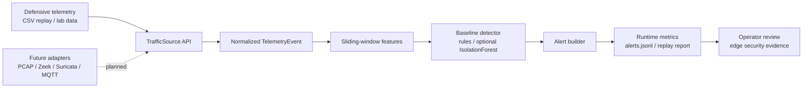

# Jetson Edge AI Security

Jetson Edge AI Security is a production-oriented defensive telemetry runtime for edge IDS research and deployment. It converts replayed or observed security telemetry into normalized events, rolling features, baseline detections, alerts, and benchmark-ready metrics.

The project is edge-native because the runtime is built around streaming sources, small memory windows, conservative baseline detection, and simple dependencies that can run on Jetson-class devices before heavier model runners are introduced.

> [Evidence landing page](https://obiedeh.github.io/jetson-edge-ai-security/reports/index.html) | [Static dashboard](https://obiedeh.github.io/jetson-edge-ai-security/reports/dashboard.html) | [Technical brief](https://obiedeh.github.io/jetson-edge-ai-security/reports/tech-brief.html) | [Business case](https://obiedeh.github.io/jetson-edge-ai-security/reports/business-case.html) | [Architecture](docs/architecture.md) | [Thor runbook](deploy/thor/operator-runbook.md)

## Core Stack

**Implemented:** Python · Typer · Pydantic · CSV replay · sliding-window features · baseline anomaly detection · Pytest

**Planned / integration path:** Jetson runtime metrics · PCAP/Zeek/Suricata adapters · public dataset replay artifacts

<p>
  
  
  
  
  
  
  
</p>

## Architecture and Evidence

- [Evidence landing page](https://obiedeh.github.io/jetson-edge-ai-security/reports/index.html)
- [Static dashboard](https://obiedeh.github.io/jetson-edge-ai-security/reports/dashboard.html)
- [Technical brief](https://obiedeh.github.io/jetson-edge-ai-security/reports/tech-brief.html)
- [Business case](https://obiedeh.github.io/jetson-edge-ai-security/reports/business-case.html)
- [Architecture overview](docs/architecture.md)
- [System architecture diagram](docs/diagrams/system-architecture.mmd)
- [Runtime flow diagram](docs/diagrams/runtime-flow.mmd)
- [Data flow diagram](docs/diagrams/data-flow.mmd)
- [Deployment view diagram](docs/diagrams/deployment-view.mmd)
- [Sample outputs](artifacts/sample-outputs/)
- [Logs](artifacts/logs/)
- [Reports](artifacts/reports/)



## Recommended GitHub About

- **Suggested short description:** Edge AI runtime security system for Jetson-class devices with telemetry parsing, anomaly detection, alerting, and deployment reports.
- **Suggested topics/tags:** `jetson`, `edge-ai`, `security`, `anomaly-detection`, `telemetry`, `runtime-monitoring`, `ai-infrastructure`
- **Positioning category:** Core

## Current MVP

- Pluggable `TrafficSource` API with context-manager lifecycle.
- `TelemetryEvent` and `Alert` schemas using Pydantic.
- CSV replay for Edge-IIoT style datasets and similar IDS exports.
- Sliding window feature extraction over an iterable event stream.
- Rule-based baseline detector with optional `sklearn` IsolationForest.
- Pipeline runner that tracks events, windows, detections, and emitted alerts.
- Typer CLI for config validation, CSV replay, and a built-in demo.

## Execution Targets

- Linux is the primary runtime target.
- Jetson Orin-class Linux is the intended edge deployment target for this project.
- The current MVP should run as a lightweight Python runtime for CSV replay and baseline detection on Jetson-class devices.
- Jetson hardware benchmark artifacts are still pending and should be added before claiming measured edge performance.

## Telemetry Source Strategy

The runtime normalizes every source into `TelemetryEvent` before feature extraction. That keeps ML, detection, alerting, and reporting independent from the source adapter.

Supported now:

- CSV replay from defensive datasets and lab captures.

Planned adapters:

- PCAP replay for packet captures.
- Live capture for defensive interface monitoring.
- MQTT telemetry ingestion.
- Zeek log ingestion.
- Suricata EVE JSON ingestion.

Attack traffic support is intentionally limited to controlled defensive lab telemetry, replay, simulation, and IDS-log ingestion.

## What Is Intentionally Not Included

- Offensive malware generation or exploitation tooling.
- Autonomous attack execution.
- Notebook-only runtime paths.
- Deep learning as the default detector.
- Hardcoded `/data` paths or hidden global state.

Existing notebooks and reports should remain reference material. Reusable academic ideas are preserved in runtime form through CSV column mapping, label normalization, timestamp parsing, temporal aggregation, leakage-aware feature windows, and attack-count forecasting scaffolding.

## Install

```bash
git clone https://github.com/obiedeh/jetson-edge-ai-security.git
cd jetson-edge-ai-security
python -m venv .venv
source .venv/bin/activate
python -m pip install -e ".[dev]"
```

Optional ML detector support:

```bash
python -m pip install -e ".[ml]"
```

## Run Tests

```bash
python -m pytest
```

## Validate Config

```bash
edge-security validate-config --config configs/default.yaml
```

## Run CSV Replay

```bash
edge-security replay-csv --path data/sample.csv --limit 1000
```

For malformed-row enforcement during data quality checks:

```bash
edge-security replay-csv --path data/sample.csv --strict
```

## Public Dataset Mode

You can list known public defensive datasets:

```bash
edge-security list-datasets
```

For datasets with an allowlisted direct archive URL, the runtime can download, extract, find a CSV, and replay it:

```bash
edge-security fetch-dataset wustl-iiot-2021
edge-security replay-dataset wustl-iiot-2021 --limit 1000
```

The first auto-download target is `wustl-iiot-2021`, because its official project page exposes a direct ZIP archive. Other noteworthy datasets, such as CICIoT2023, ToN_IoT, BoT-IoT, and Edge-IIoTset, are listed for awareness but may require manual download through forms or SharePoint. For those, download the dataset yourself and use `replay-csv --path <local.csv>`.

## Run This Demo

```bash
edge-security run-demo
```

## Generate Evidence Artifacts

```bash
edge-security generate-demo-report --output-dir reports/demo
edge-security build-static-reports --reports-dir reports
```

The demo report writes:

- `reports/demo/runtime_metrics.json`
- `reports/demo/alerts.jsonl`
- `reports/demo/replay_report.md`
- `reports/index.html`
- `reports/dashboard.html`
- `reports/tech-brief.html`
- `reports/business-case.html`

For the reviewer-facing deliverables checklist, see [PORTFOLIO_DELIVERABLES.md](PORTFOLIO_DELIVERABLES.md).

## Validated on Jetson AGX Thor

**Target hardware:** NVIDIA Jetson AGX Thor (64 GB LPDDR5, tegra-234)
**JetPack:** 6.x · TensorRT 10.x · CUDA 12.x

Performance gates (from `reports/thor_benchmark.json`):

| Gate | Threshold | Status |
|---|---|---|
| Detector p95 latency (TensorRT FP16) | ≤ 10 ms per flow | Pending first Thor run |
| Forecaster p95 latency (TensorRT FP16) | ≤ 50 ms per (20, 57) sequence | Pending first Thor run |
| Throughput @ 1000 ev/s sustained 5 min | ≥ 1000 ev/s | Pending first Thor run |
| Memory footprint (both engines + service) | ≤ 4 GB | Pending first Thor run |

Numbers are **measured, not aspirational**. Run `deploy/thor/run_benchmark.py` on
the actual hardware to populate `reports/thor_benchmark.json` with real figures.
The dashboard `validated-thor-benchmark` badge appears once the benchmark has run.

### Deploy to Thor

```bash
# 1. Build web dashboard on dev machine
cd web && pnpm build && cd ..

# 2. Copy to Thor
scp -r . thor:/tmp/edge-ids-src

# 3. Install on Thor (as root)
ssh thor "sudo bash /tmp/edge-ids-src/deploy/thor/install.sh"

# 4. Build TensorRT engines
ssh thor "python3 /opt/edge-ids/deploy/thor/build_tensorrt_engines.py --fp16"

# 5. Run benchmark (5 min per tier)
ssh thor "python3 /opt/edge-ids/deploy/thor/run_benchmark.py --trt"
```

See `deploy/thor/operator-runbook.md` for full install / upgrade / rollback procedures.

## Deployment Architecture

The runtime is designed so Thor deployment adds hardware-specific packaging
without changing the detection pipeline:

- FastAPI backend serves both the REST API and the web dashboard static build.
- TensorRT FP16 engines replace ONNX CPU inference on Jetson.
- `edge-security.service` (systemd) manages the process with auto-restart.
- SQLite alerts store persists to `/var/lib/edge-ids/data/` (survives restarts).
- PCAP replay source simulates SPAN/mirror traffic for offline validation;
  live capture (`libpcap`) is deferred to v1.x.
