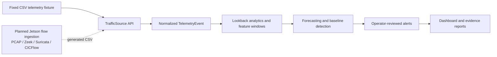

# Jetson Edge Intrusion Detection

**Defensive edge telemetry, lookback analytics, forecasting, and operator-reviewed IDS alerts for Jetson-class network nodes.**

Jetson Edge Intrusion Detection is a defensive edge telemetry system for Jetson-class nodes. The current implementation uses fixed CSV telemetry as a deterministic fixture for lookback analytics, forecasting, operator-reviewed alerts, reports, and dashboard evidence.

Fixed CSV is the deterministic test fixture, not the product ceiling. The planned Jetson sniffer upgrade adds Jetson-generated flow CSVs from packet capture and defensive telemetry sources such as Zeek logs, Suricata `eve.json`, and CICFlow-style records.

> [Open the evidence landing page](https://obiedeh.github.io/jetson-edge-ai-security/reports/index.html) | [Open the static dashboard](https://obiedeh.github.io/jetson-edge-ai-security/reports/dashboard.html) | [Architecture](docs/architecture.md) | [Thor runbook](deploy/thor/operator-runbook.md) | [Sniffer upgrade plan](docs/jetson-sniffer-upgrade-plan.md)

## Current Implementation

The working pipeline is intentionally small and inspectable:

```text
fixed CSV telemetry
  -> normalized TelemetryEvent records
  -> lookback analytics and sliding-window features
  -> baseline detection and forecasting evidence
  -> operator-reviewed alerts
  -> dashboard, reports, and benchmark artifacts
```

Implemented today:

- Pluggable `TrafficSource` API with context-manager lifecycle.
- `TelemetryEvent` and `Alert` schemas using Pydantic.
- CSV replay for Edge-IIoT-style datasets and similar IDS exports.
- Suricata EVE JSON source (`flow`, `alert`, `stats`; replay or `--follow` tail mode).
- MQTT telemetry source (paho-mqtt v2, configurable topics and payload field map).
- Alert sinks: JSONL file, the dashboard's SQLite store, and an optional AWS IoT Core publisher (off by default).
- Sliding-window feature extraction over iterable event streams.
- Rule-based baseline detector with optional `sklearn` IsolationForest support.
- Pipeline runner that tracks events, windows, detections, skipped rows, and emitted alerts.
- Typer CLI for config validation, CSV replay, demo execution, and static report generation.
- Static evidence pack under `reports/`.

## Why This Matters

Edge nodes, robotics cells, private-network sites, and AI-enabled systems need local defensive telemetry that can be reviewed close to the runtime environment. The value here is not replacing a SIEM or claiming a production IDS. The value is making local flow-style signals observable, forecastable, reviewable, and benchmarkable near the edge.

## Run This Demo

```bash
git clone https://github.com/obiedeh/jetson-edge-ai-security.git
cd jetson-edge-ai-security
python -m venv .venv
source .venv/bin/activate
python -m pip install -e ".[dev]"
edge-security run-demo
edge-security generate-demo-report --output-dir reports/demo
edge-security build-static-reports --reports-dir reports
```

Optional ML detector support:

```bash
python -m pip install -e ".[ml]"
```

## View the Evidence Pack

- [Landing page](reports/index.html)
- [Dashboard](reports/dashboard.html)
- [Demo replay report](reports/demo/replay_report.md)
- [Runtime metrics](reports/demo/runtime_metrics.json)
- [Training evidence](reports/training_run.json)
- [Thor benchmark, measured](reports/thor_benchmark.json) with the [1 Hz tegrastats series](reports/thor_benchmark_tegrastats.jsonl) and [run log](reports/thor_benchmark_run.log)
- [Thread-pool power comparison](reports/thor_benchmark_threads.json) built from [`reports/thor_threads/`](reports/thor_threads/) by [deploy/thor/compare_thread_runs.py](deploy/thor/compare_thread_runs.py)
- [Publication plan: what a write-up can and cannot claim yet](docs/publication-plan.md)
- [Portfolio deliverables](PORTFOLIO_DELIVERABLES.md)

GitHub shows committed HTML files as source code. Use the GitHub Pages links at the top of this README to open rendered pages.

## Current vs Planned

| Layer | Current working system | Planned Jetson ingestion upgrade |
|---|---|---|
| Input source | Fixed CSV fixture, Suricata `eve.json`, MQTT JSON telemetry | Jetson-generated flow CSV |
| Capture mode | Deterministic replay | SPAN, TAP, or local interface capture |
| Packet stage | Not required for current evidence | Rotating PCAP files |
| Flow extraction | CSV columns, Suricata `eve.json` flow/alert/stats records, and MQTT JSON payloads normalized into `TelemetryEvent` | Zeek `conn.log`, CICFlow-style records |
| Analytics path | Lookback analytics, forecasting, alerts, reports | Same existing analytics path |
| Dashboard impact | Implemented | No detector/dashboard rewrite intended |
| Hardware benchmark | Measured inference run committed (CPU provider) | Capture and flow-extraction measurement |

Adapters may change. The analytics pipeline should not.

## Defensive Boundary

This repo is defensive only.

- No malware generation.
- No exploit replay.
- No offensive tooling.
- No autonomous response.
- No line-rate capture claim.
- No production IDS deployment claim.
- Thor numbers are inference-only measurements from the committed artifact, on the CPU execution provider, with synthetic inputs. No capture, flow-extraction, or end-to-end latency claim.

## Planned Jetson Sniffer Upgrade

The planned upgrade is documented in [docs/jetson-sniffer-upgrade-plan.md](docs/jetson-sniffer-upgrade-plan.md).

Planned pipeline:

```text
SPAN/TAP/local interface
  -> rotating PCAP
  -> Zeek / Suricata / CICFlow-style flow extraction
  -> generated CSV
  -> existing lookback, forecasting, alert, and dashboard pipeline
```

The intent is source-agnostic flow ingestion. New sources should normalize into the same event/schema contract instead of forcing a detector or dashboard rewrite.

## Evidence Status

| Evidence | Status |
|---|---|
| Fixed CSV fixture replay | Implemented |
| Lookback analytics | Implemented |
| Forecasting evidence | Implemented |
| Operator-reviewed alerts | Implemented |
| Static landing page and dashboard | Implemented |
| Suricata EVE JSON source (`replay-eve`, follow mode) | Implemented, fixture-tested |
| MQTT telemetry source (`run-mqtt`, Mosquitto demo) | Implemented, fake-client tests; one verified local broker run |
| Alert sinks: JSONL, SQLite (dashboard), AWS IoT Core | Implemented, off by default; IoT Core tested with a fake client only, no cloud run yet |
| Ingestion micro-benchmark (EVE and CSV sources) | Measured on the RTX 5090 host; Thor run pending |
| Zeek / CICFlow adapters | Planned |
| Jetson-generated flow CSV | Planned |
| Thor-class hardware benchmark | Measured, inference only, CPU provider |

## Architecture and Evidence

- [Architecture overview](docs/architecture.md)
- [System architecture diagram](docs/diagrams/system-architecture.mmd)
- [Runtime flow diagram](docs/diagrams/runtime-flow.mmd)
- [Data flow diagram](docs/diagrams/data-flow.mmd)
- [Deployment view diagram](docs/diagrams/deployment-view.mmd)

The `artifacts/` directories are reserved for future capture-stage evidence and currently hold only placeholders. Committed evidence lives under `reports/` and `models/exports/`.


```mermaid
flowchart LR
    A["Fixed CSV telemetry fixture"] --> B["TrafficSource API"]
    B --> C["Normalized TelemetryEvent"]
    C --> D["Lookback analytics and feature windows"]
    D --> E["Forecasting and baseline detection"]
    E --> F["Operator-reviewed alerts"]
    F --> G["Dashboard and evidence reports"]
    H["Planned Jetson flow ingestion<br/>PCAP / Zeek / Suricata / CICFlow"] -. "generated CSV" .-> B
```

## Core Stack

**Implemented:** Python, Typer, Pydantic, CSV replay, sliding-window features, baseline anomaly detection, pytest.

**Implemented ingestion:** CSV replay, Suricata `eve.json` (replay and follow), MQTT JSON telemetry. **Alert sinks:** JSONL, SQLite dashboard store, optional AWS IoT Core.

**Planned ingestion path:** Jetson-generated flow CSVs, Zeek logs, CICFlow-style records, Thor-class benchmark evidence.

<p>
  
  
  
  
  
  
  
</p>

## Commands

Validate config:

```bash
edge-security validate-config --config configs/default.yaml
```

Run CSV replay:

```bash
edge-security replay-csv --path data/sample.csv --limit 1000
```

Enforce malformed-row handling:

```bash
edge-security replay-csv --path data/sample.csv --strict
```

Replay a Suricata `eve.json` file, or follow one that Suricata is still writing (Ctrl-C stops cleanly; `--idle-timeout` exits after a quiet period):

```bash
edge-security replay-eve --path /var/log/suricata/eve.json --limit 10000 --output-dir reports/eve
edge-security replay-eve --path /var/log/suricata/eve.json --follow --json-output
```

Subscribe to MQTT telemetry (broker, topics and payload field map come from the `mqtt:` section of the config; see [deploy/mqtt-demo/README.md](deploy/mqtt-demo/README.md) for a local Mosquitto demo):

```bash
edge-security run-mqtt --config configs/default.yaml --json-output
```

Alert sinks are configured under `sinks:` in the config and are all disabled by default. Enable the JSONL or SQLite sink to persist alerts from any of the config-driven commands; enable `iot_core` to publish alerts and health snapshots to AWS IoT Core on `edge-security/{thing}/alerts` and `/health` (QoS 1, bounded queue, retry with backoff, background thread). Endpoint, thing name and certificate paths are read from the config or the `EDGE_SECURITY_IOT_ENDPOINT` / `_THING` / `_CERT` / `_KEY` / `_CA` environment variables and are never committed; the SDK is the optional `cloud` extra:

```bash
python -m pip install -e ".[cloud]"
```

List known public defensive datasets:

```bash
edge-security list-datasets
```

Fetch and replay an allowlisted dataset:

```bash
edge-security fetch-dataset wustl-iiot-2021
edge-security replay-dataset wustl-iiot-2021 --limit 1000
```

Run tests:

```bash
python -m pytest
```

Run the full verification path:

```bash
make verify
```

## Ingestion Benchmark

`deploy/bench/bench_sources.py` replicates the committed EVE and CSV fixtures with shifted timestamps and measures source-only parsing, the full pipeline (`window_size` 50, `step` 10, baseline detector), and the same pipeline with a JSONL sink and with JSONL plus an in-process no-op IoT Core client. It measures ingestion and detection on the host it runs on; it makes no capture or line-rate claim.

Workstation run, committed as [`reports/bench/ingest_aimlstation.json`](reports/bench/ingest_aimlstation.json) (`aimlstation`, x86_64, 24 logical CPUs, Python 3.12.3, median of 3 rounds):

| Source | Events | Source-only ev/s | Pipeline ev/s | Detect p95 ms | Pipeline + JSONL ev/s | Pipeline + JSONL + IoT (no-op) ev/s |
| --- | --- | --- | --- | --- | --- | --- |
| Suricata EVE | 40,000 | 78,212 | 55,257 | 0.0030 | 49,948 | 47,137 |
| CSV replay | 36,000 | 75,300 | 57,366 | 0.0025 | 54,143 | 50,615 |

Run it on the workstation:

```bash
.venv/bin/python deploy/bench/bench_sources.py
```

Run it on the Jetson AGX Thor (from the device; results are only claimed once the artifact is committed):

```bash
ssh jetsonthor
cd ~/jetson-edge-ai-security && git pull
uv venv .venv --python 3.12 && uv pip install --python .venv/bin/python -e ".[dev]"
.venv/bin/python deploy/bench/bench_sources.py --label thor --output reports/bench/ingest_thor.json
```

Then commit `reports/bench/ingest_thor.json` and add its row to this table. The Thor row is not yet measured.

## Thor-Class Deployment Readiness

**Measured device:** Jetson AGX Thor Developer Kit (`tegra264`), R38 (release), `nvpmodel` 120W, 14 CPU cores, 122 GB RAM, Python 3.12.3, onnxruntime 1.29.0. Run `3cac5ed2b7bd`, 2026-09-08, 300 s per tier at 10, 100 and 1000 events/s, 60 s idle sampling before and after. Artifact: [`reports/thor_benchmark.json`](reports/thor_benchmark.json); 1 Hz board telemetry: [`reports/thor_benchmark_tegrastats.jsonl`](reports/thor_benchmark_tegrastats.jsonl); console log: [`reports/thor_benchmark_run.log`](reports/thor_benchmark_run.log).

| Gate | Threshold | Measured at 1000 events/s | Status |
|---|---|---|---|
| Detector p95 latency | <= 10 ms per flow | **0.0237 ms** (p50 0.0213, p99 0.028, max 14.7371) | pass |
| Forecaster p95 latency | <= 50 ms per `(20, 57)` sequence | **0.0141 ms** (p50 0.0138, p99 0.0143, max 1.0395) | pass |
| Throughput at 1000 events/sec | >= 1000 events/sec | **1000.0 events/s** achieved by both models | pass |
| Memory footprint | <= 4 GB | **0.3639 GB** peak process RSS | pass |

What these numbers are and are not:

- **CPU execution provider.** The PyPI `onnxruntime-gpu` 1.29.0 wheel loads a CUDA provider on Thor but fails at run time with `cudaErrorNoKernelImageForDevice`; the NVIDIA Jetson package index has no JetPack 7 build. The harness recorded the failure and fell back to CPU. For models this small (106 KB and 3 KB ONNX) the GPU would not change the result.
- **Inference only.** Inputs are synthetic Gaussian tensors of the model input shapes, batch 1, one process, open-loop pacing. Packet capture, flow extraction and end-to-end packet-to-alert latency are not measured.
- **Board power and the thread pool.** Idle VIN was 24170 mW and the forecaster tiers stayed near idle. In the full run the detector session drew about 54 W at 100 and 1000 events/s with 43118 pacing misses at the top tier. A matched comparison ([`reports/thor_benchmark_threads.json`](reports/thor_benchmark_threads.json), 120 s per tier, runs `1e430379de9b` and `42314e8252e9`) measured the cause: with onnxruntime defaults the detector drew **54102 mW** with **16944** misses at 1000 events/s; with `intra_op_num_threads=1`, `inter_op_num_threads=1` and spin waiting disabled it drew **24312 mW** with **0** misses, p95 0.0238 to 0.0219 ms, max 14.4675 to 0.9852 ms, junction peak 56.562 to 40.375 C. The CPU rail fell from 35366 to 7469 mW. The forecaster changed by under 0.2 W either way. For models this small the default spin-waiting thread pool costs about 30 W and buys nothing; the runbook now recommends the single-thread options for deployment. Raw runs: [`reports/thor_threads/`](reports/thor_threads/).
- **Repeated and alternated, 2026-09-12.** One run per configuration cannot carry a 30 W claim, so the comparison was repeated three times each in strict alternation (default, single, default, single, default, single), 120 s at 1000 events/s, CPU provider, with a cooldown gate before every run that waited until board power was within 1 W of the session idle (23.8 W) and junction temperature within 2 C of 39.3 C; every run settled and each run's own 60 s idle reading is in its artifact ([`reports/thor_threads_repeats/`](reports/thor_threads_repeats/), [`summary.json`](reports/thor_threads_repeats/summary.json) from [`deploy/thor/analyze_thread_repeats.py`](deploy/thor/analyze_thread_repeats.py)). Detector at 1000 events/s:

| Run | Threads | VIN p50 mW | CPU rail p50 mW | p95 ms | Pacing misses | Tj peak C | Idle before run, mW |
|---|---|---|---|---|---|---|---|
| run1_default | default | 53,438 | 34,973 | 0.0241 | 14,043 | 54.687 | 23,786 |
| run2_single | single | 24,260 | 7,469 | 0.0220 | 0 | 40.25 | 24,010 |
| run3_default | default | 53,712 | 34,973 | 0.0238 | 15,827 | 54.5 | 23,894 |
| run4_single | single | 23,950 | 7,076 | 0.0220 | 0 | 40.093 | 23,904 |
| run5_default | default | 53,442 | 34,973 | 0.0240 | 15,080 | 53.812 | 23,908 |
| run6_single | single | 23,942 | 7,469 | 0.0221 | 1 | 39.906 | 23,978 |

  Default pool: median 53,442 mW, range 53,438 to 53,712. One thread, no spin: median 23,950 mW, range 23,942 to 24,260. The ranges do not overlap. Paired differences in run order: 29,178, 29,762, 29,500 mW, median **29,500 mW**; pacing misses 14,043, 15,827, 15,079 fewer; detector p95 0.0019 ms lower with one thread. The forecaster shows no gap: default median 24,180 mW against 23,952 mW with overlapping ranges, so none is claimed for it. Concurrent load: the GNOME desktop session was active throughout (process snapshots before each run are in the directory; `ps` percentages there are lifetime averages, and the harness recorded a one-minute load average near 1.9 at each start); both vLLM containers were stopped and nothing was on the GPU. A second session with the desktop stopped is planned for comparison.
- **Host state.** One-minute load average was 3.1 at start from unrelated desktop activity, recorded in the artifact.

Reproduce on the device with the harness in [deploy/thor/run_benchmark.py](deploy/thor/run_benchmark.py); see [deploy/thor/operator-runbook.md](deploy/thor/operator-runbook.md) for install, upgrade, rollback, and benchmark procedures.

## Roadmap

The next steps are intentionally narrow:

- Add source adapters that generate the same CSV/event contract from Zeek and CICFlow-style records (Suricata EVE and MQTT are implemented).
- Run the ingestion benchmark on Thor and a manual IoT Core publish from the device; both are pending.
- Measure end-to-end packet-to-alert latency on Thor; the inference-only benchmark and the thread-pool power comparison are committed.
- Add packet-drop and flow-extraction measurements before making capture-performance claims.
- Keep all response actions operator-reviewed.

